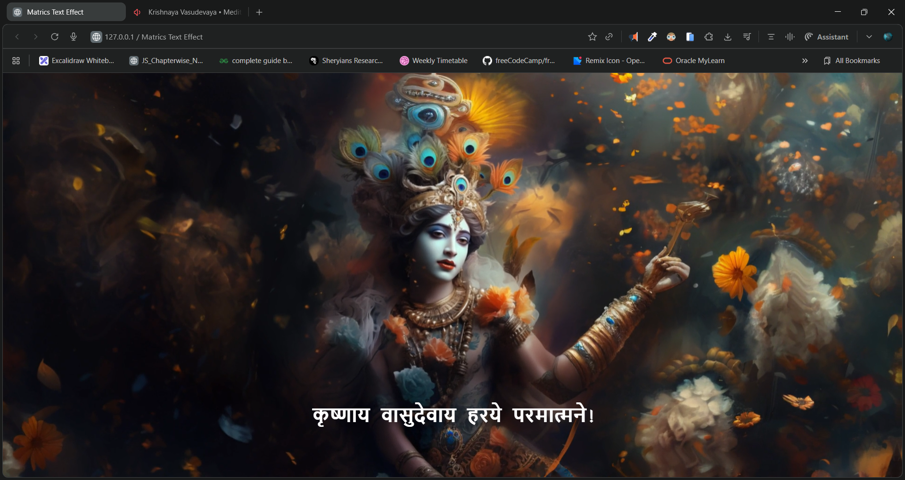

# 🌌 Matrics Text Effect - कृष्णाय वासुदेवाय हरये परमात्मने

A stunning matrix-style Sanskrit text-reveal effect built using **HTML**, **CSS**, and **JavaScript**.
The text beautifully morphs from random Devanagari characters into your chosen phrase when the user hovers over it.

---

## 📸 Preview



---

## 🎥 Demo Video

🔗 **Demo Video:** [click to watch](https://youtu.be/3XEjZYJYsvo)

---

## 🌐 Live Demo

🔗 **Live Project:** [https://dileep-kumawat.github.io/Matrics-text-effect-using-html-css-and-js/](https://dileep-kumawat.github.io/Matrics-text-effect-using-html-css-and-js/)

---

## ✨ Features

* 🎞️ **Background loop video** for an immersive feel
* 🔡 **Random Devanagari character animation** inspired by Matrix effect
* 🎭 Smooth text reveal on hover
* 🎨 Custom **Krishna font** integration
* 💡 Lightweight, pure JavaScript - no libraries needed

---

## 🗂️ Project Structure

```
/project
│── index.html
│── style.css
│── script.js
│── Krishna.ttf
│── video.mp4
│── preview.png   
```

---

## 🧩 How It Works

### 🔸 index.html

Contains the video background and animated < h1> text

### 🔸 script.js

Handles the character-scramble animation on hover


### 🔸 style.css

Loads the custom font and positions the video + text


---

## 🚀 How to Use

1. Download or clone the project
2. Ensure all files (including `Krishna.ttf` and `video.mp4`) stay in the root folder
3. Open **index.html** in any browser
4. Hover over the text to see the magic ✨

---

## 🛠️ Customization

### 🔹 Change the Text

Edit the line in `index.html`:

```html
<h1>कृष्णाय वासुदेवाय हरये परमात्मने!</h1>
```

### 🔹 Change Animation Characters

Modify the `letters` string in `script.js`.

### 🔹 Use Another Video

Replace `video.mp4` with your own and update the path if needed.

---

## ⭐ Credits

* **Developer:** *Dileep Kumawat*
* Custom Krishna Font
* Matrix-style text transformation logic by JavaScript

---

## 🧑‍💻 Author

**Dileep**
Made with 💖 & JavaScript.
- 📧 [dileepkumawat525@gmail.com](mailto:dileepkumawat525@gmail.com)
- 🔗 [LinkedIn](https://www.linkedin.com/in/dileep-kumawat/)
